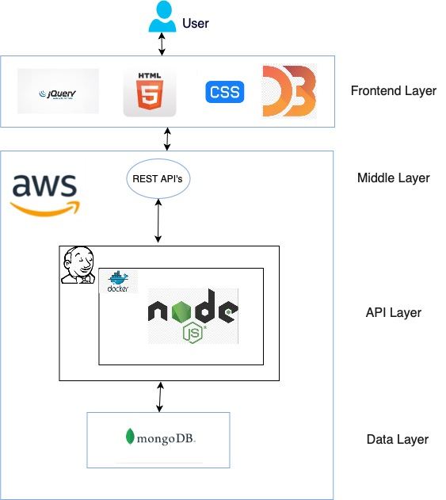

# Opinion Miner

## Abstract

What if you want to know as a business, how your product is getting a response from customers? Is it positive, in other words, is your product popular among consumers or negative and people didn’t like the product? Or, you are curious to know what is happening around you but you don’t know where to go. Here comes Opinion Miner, a tool that shows trends and does sentiment analysis on any word or topic in general. You just have to type a word and the tool will let you know whether the entered word has a positive response from people or negative based on the data from twitter. The tool uses twitter API to get a live feed, does analysis in real-time, and shows it to the user. Apart from this, it also shows visibility, an important parameter used to analyze data. In simple terms, visibility means a user with more followers will have more weight towards the whole analysis as compared to the one with fewer followers. 

**Opinion Miner** is a fully functional dashboard that welcomes the user by showing the trending hashtags from twitter which are sorted country wise. And it also has a search bar to search for any particular word of user’s choice. Once a user chooses a word to analyze, the dashboard shows the following information regarding the word user has searched.

1. **Sentiment Analysis:** A comprehensive analysis of the word searched including its positivity, negativity, and visibility.
2. **Tweet Map:** A map showing where the positive and negative tweets have been tweeted across the world.
3. **Tweet Cloud:** A word cloud representing the hashtags used in tweets that have been fetched from twitter API in real-time.  
4. **Tweets:** This is nothing but the actual tweets that twitter users have tweeted which are used by the app to analyze the word.

The app was dockerized and deployed on AWS. A fully automatic CI/CD pipeline was created using Jenkins, which gets triggered every time a new commit is made to the repo and within seconds the changes get reflected to the live website.

## CI/CD Pipeline

The project is deployed on AWS using a fully automated `CI/CD` pipeline. The **Github** is used for **Continuous Integration** and combination of **Docker** and **Jenkins** are used for **Continuous Deployment**.

### Pipeline Steps

1. New changes are commited to **Github**
2. Github triggers a `webhook` sending a post request to **Jenkins** about the changes
3. Jenkins starts first pipeline which fetches all changes from Github and builds a `docker image`
4. Once the first pipeline gets completed, it triggers second pipeline which uses the `docker image` built during first pipeline and runs a container along with removing the older one and now new changes are live

## Architecture

## Output

[Video](Output/ "Output")

## Technology Stack

* NodeJS
* ExpressJS
* D3 JS
* MongoDB
* JQuery
* Docker
* Jenkins

## References

* https://developer.twitter.com/en/docs
* https://blog.risingstack.com/d3-js-tutorial-bar-charts-with-javascript/
* https://d3js.org/
* https://www.d3-graph-gallery.com/wordcloud
* https://developers.google.com/maps/documentation
* https://www.jenkins.io/doc/
* https://docs.docker.com
* https://docs.aws.amazon.com